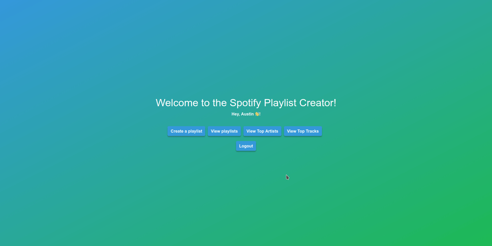

# Spotify Playlist Creator Setup Guide

<div>
  <a href="https://github.com/Austin-Metke/CST205-Final-Project" style="text-decoration: none;">
    
  </a>
  <a href="https://trello.com/b/3WILazhQ/cst-205-team-9477" style="text-decoration: none;">
    
  </a>
</div>

#### Authors: 
* [**Austin Metke**](https://github.com/Austin-Metke)
* [**Mackinzie Woodward**](https://github.com/kinziegrace4)
* [**Keith Ruxton**](https://github.com/keith-ruxton)
* [**Gabe Myers**](https://github.com/gabethemyers)
#### Class: CST-205
#### Date: 12/11/23
#### 

 #### This guide will walk you through the process of creating a Spotify Developer App and obtaining the necessary credentials (Client ID and Client Secret) in order to use this app.
---
<div align="center">
    <a href="#"></a>
</div>

## Step 1: Create a Spotify Developer Account

1. Visit the [Spotify Developer Dashboard](https://developer.spotify.com/dashboard/login) and log in with your Spotify account or create a new one.

2. Once logged in, click on the "Create an App" button.

3. Fill in the required information for your app, such as the App Name and App Description. Accept the terms of service and click on the "Create" button.

4. Your new app is now created, and you will be redirected to the app dashboard. Go to Settings and note the `Client ID` and `Client Secret` values, as you will need them in the next steps.

5. Click edit at the bottom of the settings page and add the following as a redreict URI:
   ```
   https://localhost:5000/callback
   ```
## Step 2: Configure Python Application

Open the `config.py` file. Follow these steps to configure the application with your Spotify credentials:

1. Install the necessary libraries if you haven't already:

   ```bash
   pip install Flask Flask-WTF Flask-Session Flask-Caching wtforms spotipy
   ```

2. Place your spoitfy app credentials at the top of the config.py file:

   ```python
   SPOTIPY_CLIENT_ID = 'your_client_id'
   SPOTIPY_CLIENT_SECRET = 'your_client_secret'                                                        
   ```

   Replace `'your_client_id'` and `'your_client_secret'` with the actual values obtained from the Spotify Developer Dashboard.


## Step 3: Run

  If you are on Linux or MacOS you can run Flask web server with the following command:
  
   ```bash
   ./run
   ```
   
  Alternatively you can run the command below regardless of OS:
  
  ```powershell
  flask --app app.py run --debug
  ```
